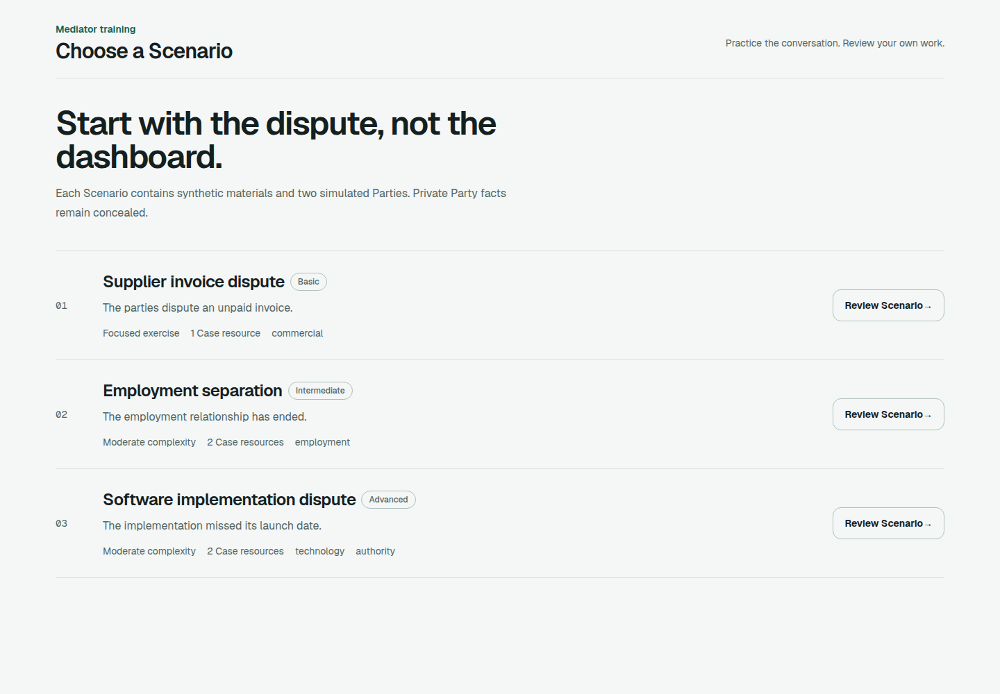
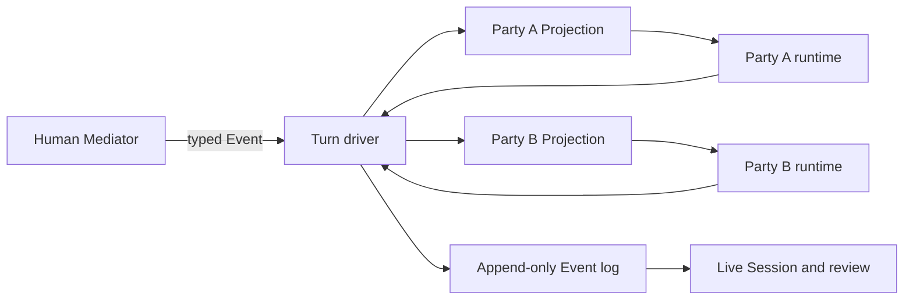

# Mediation Trainer

Practice difficult mediation conversations against independently configured AI Parties, then review the complete Session Event log.

[](https://nextjs.org/)
[](https://www.typescriptlang.org/)
[](https://stately.ai/docs/xstate)



Mediation Trainer is a local-first rehearsal environment for practicing mediators. A human Mediator works with two simulated Parties, each with its own provider, model, private facts, negotiation state, and exact-audience view of the Session.

## What works today

- Three versioned synthetic Scenarios: supplier invoice, employment separation, and software implementation
- Independent model configuration for Party A and Party B
- OpenAI, Venice AI, Ollama, and other OpenAI-compatible endpoints
- Joint Session and private Caucus flows with exact Event audiences
- Structured Offers and constrained Reaction metadata
- Agreement, impasse, Walkout, retry, refresh recovery, review, and JSON export
- Opt-in provider diagnostics with sanitized requests, responses, latency, retries, and token usage
- Memory-only provider credentials that are excluded from Session storage and exports

## Quick start

Requirements:

- Node.js 20 or newer
- npm
- One provider key per Party, unless using a local endpoint without authentication

```bash
git clone https://github.com/nacmonad/mediation-trainer.git
cd mediation-trainer/app
npm install
npm run dev
```

Open [http://localhost:3000](http://localhost:3000), choose a Scenario, configure both Parties, and begin a Session.

## Provider setup

Each Party can use a different provider and model.

| Provider | Base URL | Notes |
| --- | --- | --- |
| OpenAI | `https://api.openai.com/v1/` | Enter a model available to your account. |
| Venice AI | `https://api.venice.ai/api/v1` | Uses Venice-specific private, closed-book, structured-output controls. |
| Ollama | `http://localhost:11434/v1/` | API key can be left blank for a local no-auth server. |
| Other OpenAI-compatible | Provider-specific | The adapter appends `chat/completions`. |

Provider credentials are registered in short-lived server process memory. They are never written to browser storage, included in debug records, or exported with a Session. Restarting the application clears them.

## How a turn works

1. The Mediator appends a new Event with an explicit audience.
2. The engine derives which Parties may respond.
3. Each Party receives its current private negotiation state and only its authorized Event Projection.
4. The provider returns a structured utterance, Reaction, and optional Offer.
5. Plain TypeScript reducers apply bounded state changes and deterministic Scenario rules.
6. XState advances only the Session phase and orchestration lifecycle.



## Architecture boundaries

- **XState v5** owns Session phase and typed transitions.
- **Plain TypeScript** owns the Event log, audience Projections, behavioral state, Offers, Scenario rules, and turn ordering.
- **Zod** validates authored Scenarios, transition inputs, provider payloads, and structured Party responses.
- **Next.js Route Handlers** provide a stateless provider gateway and the short-lived credential vault.
- **Browser storage** persists committed Session snapshots locally. Provider credentials are deliberately excluded.

The project vocabulary is documented in [CONTEXT.md](CONTEXT.md). The architecture and product direction live in [PLAN.md](PLAN.md) and [OUTLINE.md](OUTLINE.md).

## Privacy boundary

The included Scenarios and Case resources are synthetic. This MVP is not yet designed for confidential client material.

Before using real professional data, the project needs a production privacy layer covering encryption, retention, provider contracts, access controls, redaction, and organization boundaries. Treat the current build as a rehearsal and development environment.

## Tests

From `app/`:

```bash
npm run test:engine
npm run lint
npx tsc --noEmit
npm run build
```

The engine suite covers Scenario parsing, audience Projections, disclosure, Offers, Reaction reduction, threshold rules, Walkout, Session transitions, recovery, retry, provider validation, and turn ordering.

## Roadmap

The proposed commercial path and one-week founding-beta scope are documented in the [paid SaaS launch strategy](docs/saas-launch-strategy.md).

- Visual Scenario builder with schema validation and preview
- Community-authored Scenario import, export, and curation
- Optional Venice Character personas for stable voice and temperament
- Streaming responses for faster perceived turns
- Hosted workspaces with managed inference and private Scenario libraries
- Evaluator workflows grounded in professional mediation standards

## Contributing

Scenario contributions are especially welcome. Keep examples synthetic, preserve exact Event audiences, and validate changes with the engine suite before opening a pull request.

For code changes, keep the established boundary intact: XState orchestrates, while plain TypeScript owns the mediation domain.

## Project status

The mediator-training flow is a live-validated MVP. It is useful, deliberately narrow, and still under active development.

## License

No license has been selected yet. Until one is added, copyright remains with the repository owner and normal open-source reuse rights are not granted.
